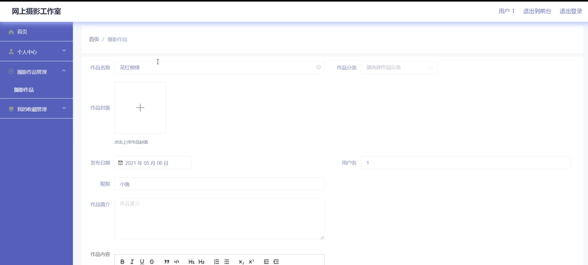

# 基于web的网上摄影工作室

#### 介绍

随着互联网的迅速发展和摄影艺术的普及，网上摄影工作室作为一个展示和交流摄影作品的平台，逐渐受到广大摄影爱好者和专业摄影师的青睐。本基于 Web 的网上摄影工作室系统旨在为用户提供一个便捷、高效、富有创意的摄影作品分享与管理空间，促进摄影艺术的传播和交流。

#### 技术栈

后端技术栈：Springboot+Mysql+Maven

前端技术栈：Vue+Html+Css+Javascript+ElementUI

开发工具：Idea+Vscode+Navicate

#### 系统功能介绍

（一）管理员角色  
个人中心：管理员可以查看和编辑个人信息，管理账户设置。  
用户管理：对注册用户进行审核、权限设置、信息修改等操作，确保用户的合法性和安全性。  
作品分类管理：对摄影作品进行分类，如人像、风景、商业等，方便用户查找和浏览。  
摄影作品管理：审核和管理用户上传的摄影作品，包括作品的展示、删除、推荐等。  
摄影圈：监督和管理摄影圈的交流内容，维护良好的交流氛围。  
系统管理：进行系统的维护和更新，包括服务器管理、数据库备份、安全设置等。  

（二）用户角色  
摄影作品：用户可以上传、浏览和分享自己的摄影作品，欣赏其他用户的优秀作品。  
摄影圈：参与摄影圈的讨论和交流，分享摄影经验、技巧和心得。  
系统公告：及时了解平台的最新动态、活动通知和规则变更。  
个人中心：修改个人资料，设置隐私选项，查看自己的作品和互动记录。  
后台管理  
摄影作品管理：对自己上传的作品进行编辑和删除操作。  
我的收藏管理：管理收藏的其他用户的优秀摄影作品。  

#### 系统作用

提供展示平台    
为摄影师和摄影爱好者提供了一个集中展示作品的空间，让更多人能够欣赏到优秀的摄影作品。  
有助于提升摄影师的知名度和影响力，为其职业发展创造机会。  
促进交流与学习  
摄影圈的存在方便了用户之间的交流，促进了摄影技术和艺术理念的分享与传播。  
用户可以从他人的作品和经验中汲取灵感，不断提高自己的摄影水平。  
方便作品管理  
对于管理员来说，能够有效地管理大量的摄影作品和用户信息，保证平台的正常运营。  
用户可以对自己的作品进行分类和整理，方便查找和回顾。  
增强用户体验  
系统公告及时传递重要信息，使用户能够更好地参与平台活动和遵循规则。  
个人中心和后台管理功能满足了用户个性化的需求，提升了用户对平台的满意度和忠诚度。  

#### 系统功能截图

代码结构

数据库表

登录

作品分类管理

系统管理

前台页面摄影作品

首页

摄影圈

用户端后台管理

我的收藏管理

摄影圈管理

#### 总结

本基于 Web 的网上摄影工作室系统通过清晰的角色划分和丰富的功能模块，为摄影爱好者和专业摄影师打造了一个充满活力和创意的线上社区。它不仅满足了用户展示作品、交流经验和管理作品的需求，也为摄影艺术的发展和传播提供了有力的支持。未来，随着技术的不断进步和用户需求的变化，系统将持续优化和创新，为用户带来更优质的服务和体验，成为摄影领域的重要交流平台。

#### 使用说明

创建数据库，执行数据库脚本 修改jdbc数据库连接参数 下载安装maven依赖jar 启动idea中的springboot项目

后台地址：http://localhost:8080/springboot07j52/admin/dist/index.html

管理员  abo 密码 abo

前台地址：http://localhost:8080/springboot07j52/front/index.html
